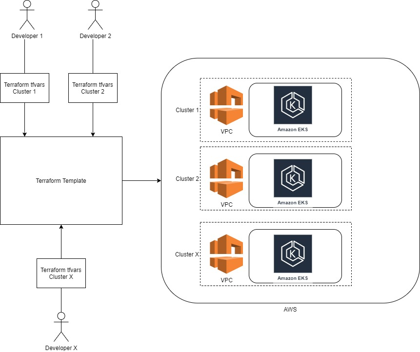

# Deploy and Manage Kubernetes Cluster in AWS - EKS Cluster

Amazon Elastic Kubernetes Service (Amazon EKS) gives you the flexibility to start, run, and scale Kubernetes applications in the AWS cloud.


## 1. Usage

1) Create a Terraform variable (.tfvars) file containing the following values

```bash
$ vim touch <my>.tfvars
```

```config
## AWS params and creds
AWS_ACCESS_KEY_ID="<AWS_ACCESS_KEY>"
AWS_SECRET_ACCESS_KEY="<AWS_SECRET_ACCESS_KEY>"
# AWS Region to use, by default "eu-west-3" 
AWS_REGION="<AWS_REGION>"

## Cluster params
# Master Name is the name that will be used to prefix all AWS Component (VPC,  to setup your deployment
MASTER_NAME="<MASTER_NAME>"
# Kubernetes version to use, by default "1.20"
K8s_VERSION="<Kubernetes_Version>"
# Type of EC2 instance to use for Worker node
INSTANCE_TYPE="t2.small"
# MINIMUM WORKER NODE
MIN_WORKER_NODE="3"
# MAXIMUM WORKER NODE
MAX_WORKER_NODE="3"
# DESIRED WORKER NODE
DESIRED_WORKER_NODE="3"
```

## 2. Installation

Use Terraform to deploy desiderated EKS Cluster


##### Init and download Terraform plugin and Module

```bash
$ terraform init
```

##### Plan the deployment and visualize what will be deployed and the changes
```bash
$ terraform plan -var-file="<tfvars file>"
```

##### Apply the deployment
```bash
$ terraform apply -var-file="<tfvars file>"
```

##### Destroy the deployment
```bash
$ terraform destroy -var-file="<tfvars file>"
```

## 3. HLD - Terraform template and tfvars to manage AWS EKS Cluster


